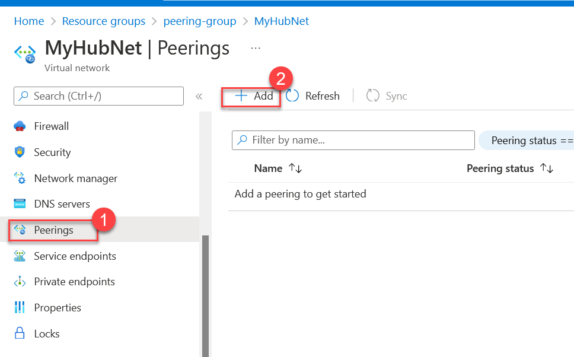
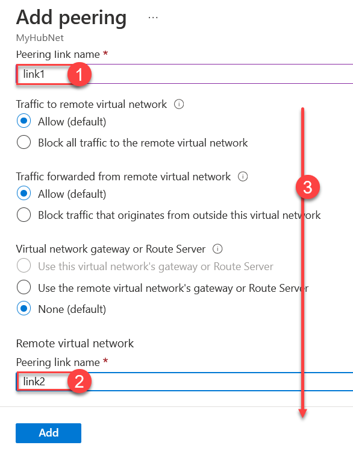
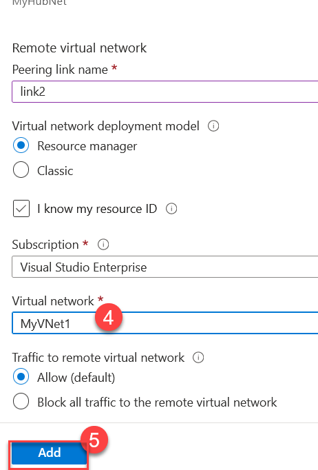
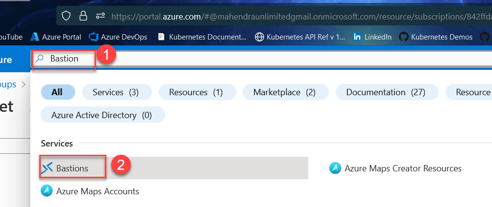
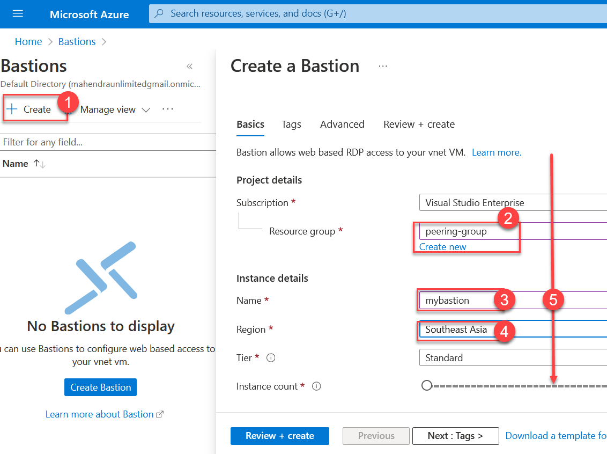
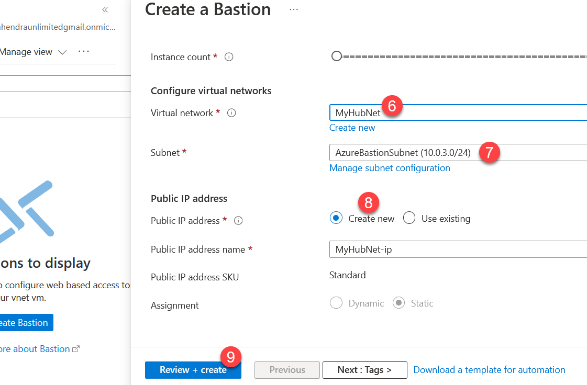

# Network Peering Demo 

Deploy Two SPOC and One Hub Network, where Network#1 has Windows Server VM and Network#2 Has Ubuntu Server VM. This template would just deploy the Network, Storage and VMs. You still need to setup Peering between Hub and Spoc.

> Objective of this template is to reduce time taken by demo, much of the steps you need to do manually.

## The Resources deployed by this template:

Resource  | Name | Type | Description
----------|------|------|------------
1 | `Generated Name`  | Storage Account | Storage for Both the VM Disk and diagnostic
2 | MyHubNet | Virtual Network | The `Hub` Virtual Network with an extra subnet for `Azure Bastion`.
3 | MyVNet1 | Virtual Network | The `SPOC` Virtual Network with one subnet and One Windows VM.
4 | MyVNet2 | Virtial Network | The `SPOC` Virtual Network with one subnet and One Ubuntu VM.

## How to use this template ?

1. 	You need to use `Azure Cloud Shell` in `Powershell` mode.
2.	Create a new resource group `peering-demo` in region `southeast asia` 
	You can create `resource-group` using following command:

	```powershell
	New-AzResourceGroup -name peering-demo -location 'southeastasia'
	```

	> feel free to use different name and/or location, but make sure `exactly same` resource group name is used in next script as well!

3.	Once `resource-group` is ready, deploy the template directly from github.

	```powershell
	New-AzResourceGroupDeployment -Name de1 -ResourceGroupName peering-group `
	-TemplateURI https://raw.githubusercontent.com/synergetics-learning/arm-templates/main/hub-spoc-network/azuredeploy.json 
	```

4.	Use azure portal to view the resources in group `peering-group`

5.	Goto "MyHubNet" Virtual Network to create `peering` with `MyVnet1`

	


6.	You need to add two connections with `MyVNet1`

	
	

7.	Just repeat step# `5` & `6` for peering between `MyHubNet` and `MyVNet2`

8.	Now, search for `bastion` service in azure portal.

	

9.	Now, Create a bastion in network `MyHubNet`

	
	